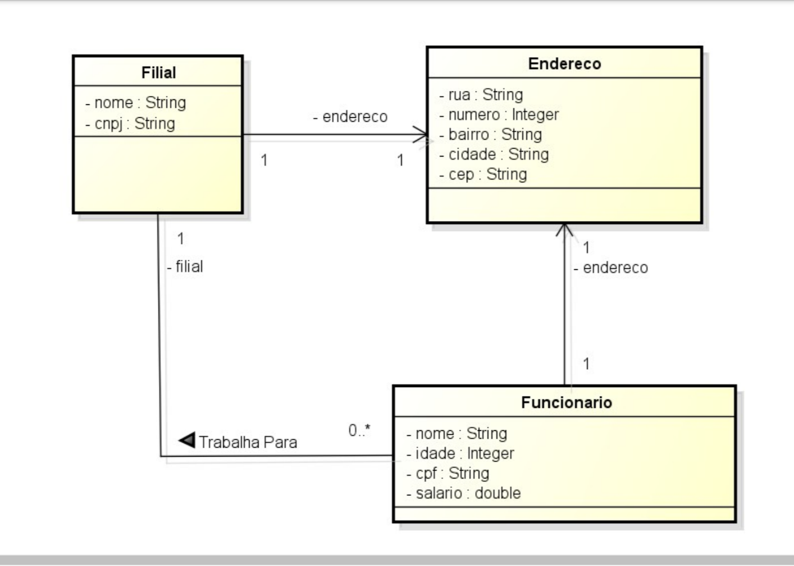

# Sistema de Gerenciamento com JSF e Banco de Dados
Este projeto é uma aplicação web desenvolvida com JavaServer Faces (JSF) integrada a um banco de dados. O objetivo é proporcionar um sistema robusto para o gerenciamento eficiente de dados.

## Descrição
Uma aplicação web utilizando JSF para a criação de interfaces ricas e interativas, conectada a um banco de dados para armazenar e gerenciar informações de forma eficiente. O sistema é projetado para fornecer uma experiência de usuário fluida e responsiva, com funcionalidades de CRUD (Criar, Ler, Atualizar, Deletar) para diferentes entidades.

## Diagrama de Classe
O Modelo e o Mapeamento das classes foram feitos de acordo com o Diagrama de Classes.  
  

## Tecnologias Utilizadas
Front-end:  

  
Back-end:  

  
Banco de Dados:  

  
Frameworks e Bibliotecas:   
   
 
## Funcionalidades
Gerenciamento de Funcionários: Adicionar, editar e excluir registros de funcionários.  
Gerenciamento de Filiais: Adicionar, editar e excluir registros de filiais.  
Relatórios: Gerar relatórios baseados em dados armazenados.  

## Instalação e Configuração
- Java EE 8 ou superior (JSF 2.3, JPA, EJB); 
- IDE Eclipse for Enterprise Java and Web Developers(Java EE) versão 2020-06-R ou inferior (desde que seja compatível com a extensão do Jboss Tools* Verificar no site);
- Servidor de Aplicações WildFly 20.0.1;
- BD Mysql 5.x (Versões mais recentes também são compatíveis, mas pode ser necessário pequena adaptação ou connector java mais recente);
- Biblioteca de Componentes Ricos para JSF - PrimeFaces 11 ou superior (Ainda a decidir a versão);
## Uso
Acesse a aplicação através do navegador web em http://localhost:8080/SeuProjeto.
Navegue pelas diferentes seções para gerenciar funcionários, filiais e gerar relatórios.
## Licença
Este projeto está licenciado sob a licença MIT.

## Contribuição
Sinta-se à vontade para contribuir com melhorias e correções. Para isso, faça um fork do repositório, crie uma branch para suas alterações, e envie um pull request.

## Sobre Mim
Olá, eu sou a Suelen! 👋
Sou desenvolvedora apaixonada por criar sistemas web eficientes e funcionais. Estou sempre buscando novos desafios e oportunidades para aplicar e expandir minhas habilidades em desenvolvimento.
